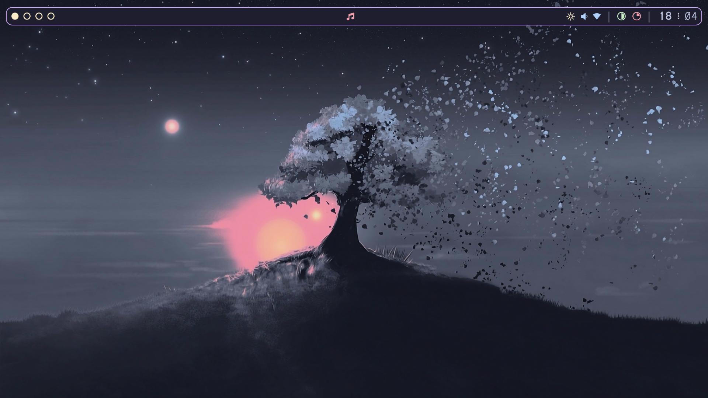
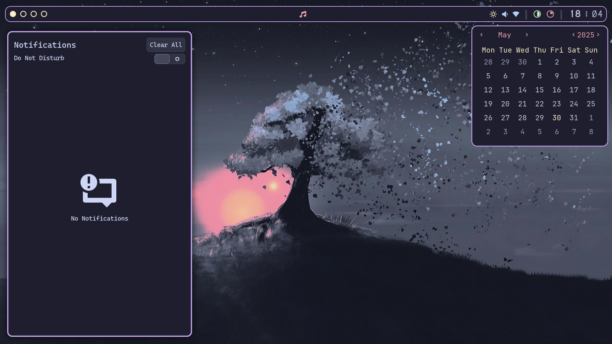
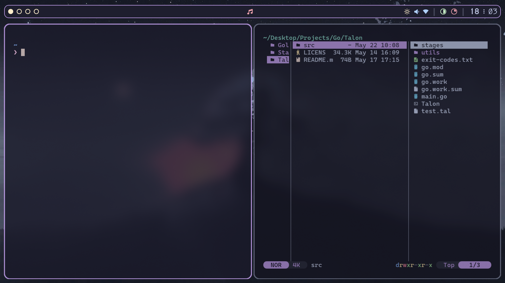
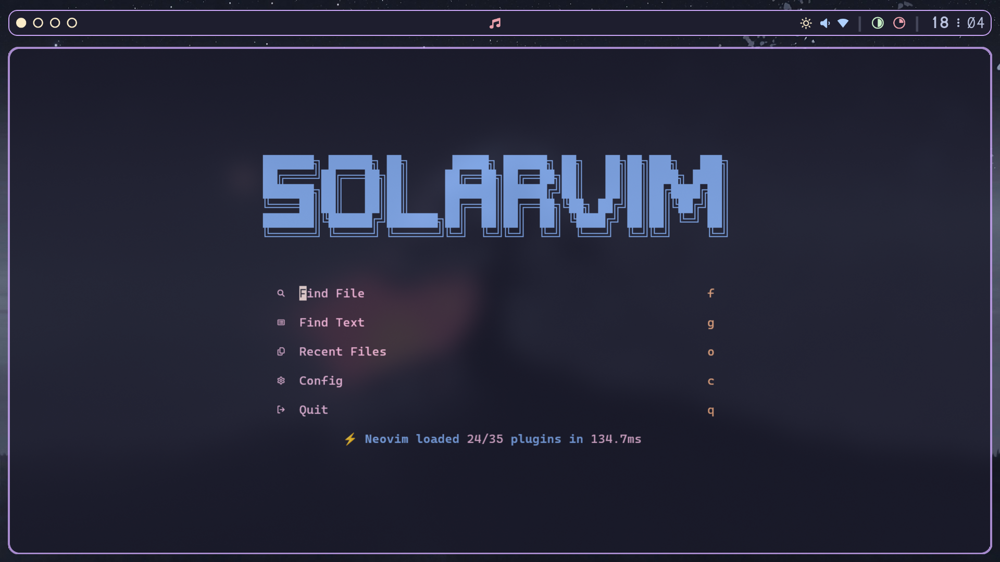
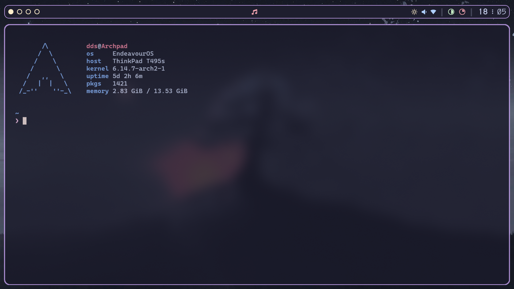
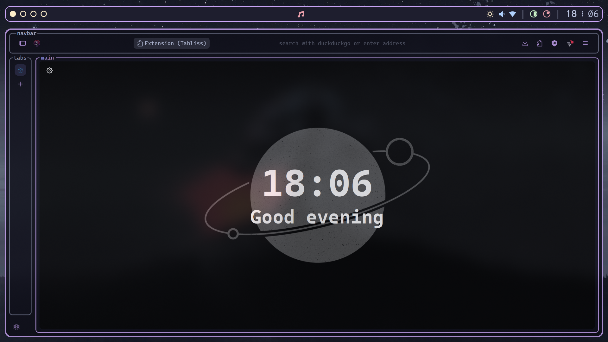

# SwayFX Dotfiles

> [!NOTE]
> A more in depth file on my dotfiles can be read [here](./misc/README.md).
> I also have a [video](https://www.youtube.com/watch?v=OfaNjMxgHG4) on it, however, most of the video uses my old waybar setup.

These are my SwayFX dotfiles. I think they're near perfect and it's been my best ricing experience.

***

## Screenshots

*Blank workspace*

*SwayNC and Calendar*

*Kitty and Yazi*

*Solarvim*

*Fastfetch*

*Librewolf*

***

## Usage
### Dependencies
- SwayFX
- SwayNC
- Waybar
- Eww
- Kitty
- Yazi
- Rofi Wayland
- Hyprlock
- Swayidle
- Waypaper
- Fastfetch

### Install
> [!NOTE]
> If you want the textfox config then once the script has finished you need to manually move the textfox config:
> See Step 9 under [Manual Install](#manual-install) to find out how.

You can either install using the [script](#script-install) I made or [manually](#manual-install).

#### Script Install
> [!IMPORTANT]
> Please **DO NOT** blindly trust scripts from the internet.
> Feel free to read over the [script](./install.sh), there are comments there detailing what the script does.
```console
curl -s https://raw.githubusercontent.com/DoubleDotStudios/SwayFX-Dotfiles/refs/heads/main/install.sh | bash -s
```

#### Manual Install
1. Clone the repo:
```console
git clone --depth=1 https://github.com/DoubleDotStudios/SwayFX-Dotfiles.git
```

2. Move the configs into `~/.config`, backup your own configs:
```console
mv ./config/* ~/.config/
```

3. Move the scripts into `~/.local/bin`:
```console
mv ./bin/* ~/.local/bin/
```

4. Move the rofi themes and scripts to `~/.local/share/rofi`:
```console
mv ./rofi/* ~/.local/share/rofi/
```

5. Move the `.zshrc` to `~`, backup your own `.zshrc`:
```console
mv ./zshrc ~/.zshrc
```

6. Move the fonts to `~/.local/share/fonts` and reload font config:
```console
mv ./fonts/* ~/.local/share/fonts/
fc-cache -f -v
```

7. Move the icons and cursors to `~/.icons`:
```console
mv ./icons/* ~/.icons/
```

8. Move the wallpapers to `~/Pictures/Wallpapers`:
```console
mv ./wallpapers/* ~/Pictures/Wallpapers/
```

9. Move the textfox config to you librewolf profile:
> [!NOTE]
> You can find out how to do this here (steps 2-6):
> https://github.com/adriankarlen/textfox#manual
```
mv ./librewolf/* PATH_TO_YOUR_PROFILE
```

10. Install [SolarVim](https://github.com/DoubleDotStudios/SolarVim) (optional)

***

## Credit
#### Catppuccin
[Sway theme](https://catppuccin.com/ports/?q=i3%2Fsway), [SwayNC](https://catppuccin.com/ports/?q=swaync), [Yazi](https://catppuccin.com/ports/?q=yazi)

#### saimoonedits
[EWW bar](https://github.com/Saimoomedits/eww-widgets) used as inspiration for Waybar, [EWW calendar](https://github.com/Saimoomedits/eww-widgets)

#### FGD
[Catppuccin Mokka Tree wallpaper](https://gitlab.com/garuda-linux/themes-and-settings/settings/garuda-mokka/-/blob/main/wallpapers/Mokka-tree.jpg?ref_type=heads)
