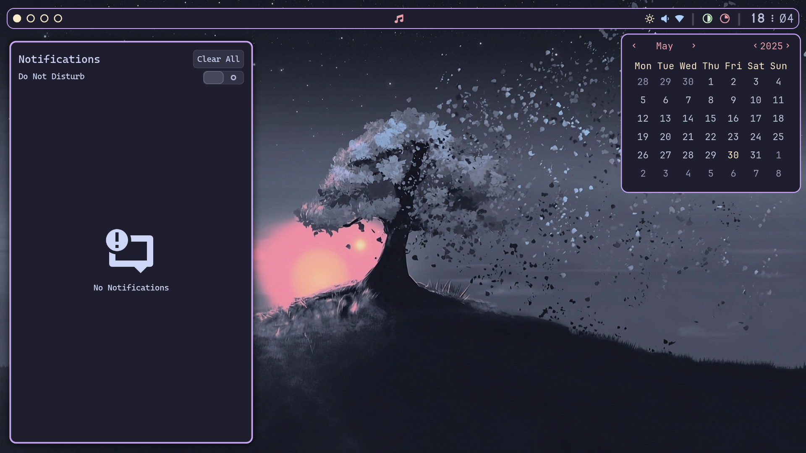
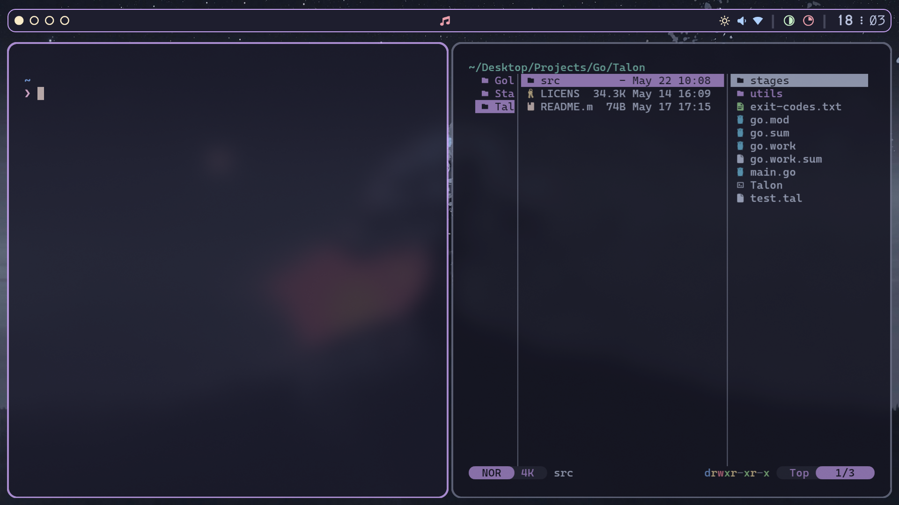
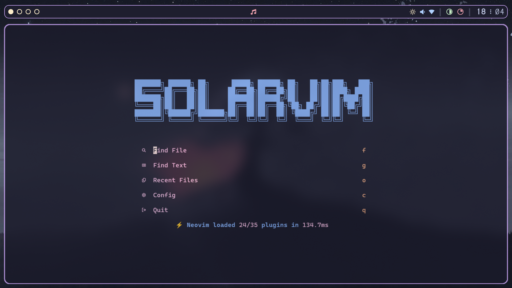
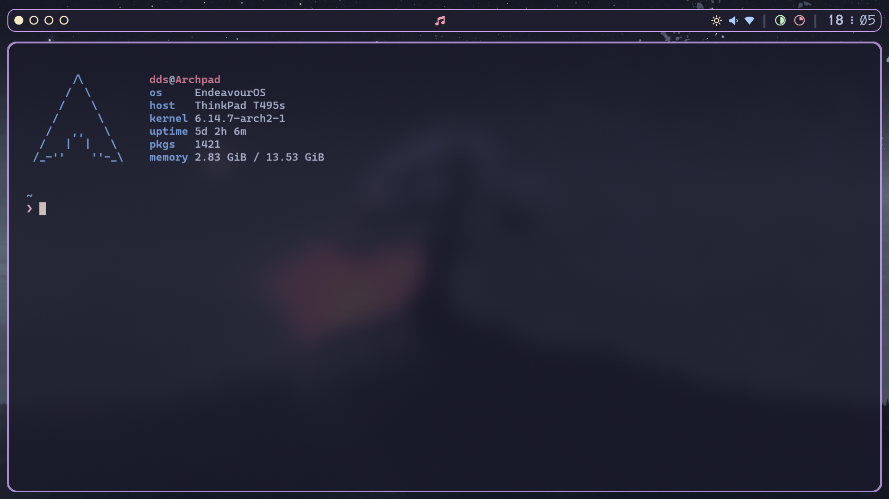
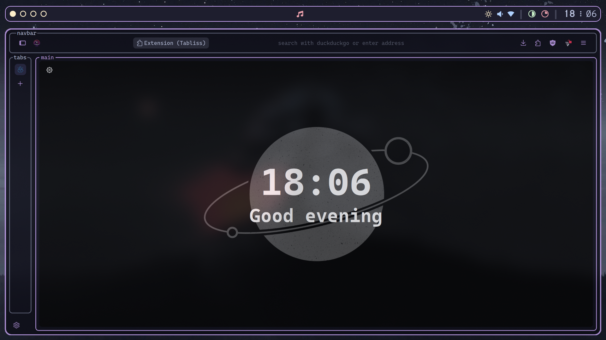

# SwayFX Dotfiles

1. [Screenshots](#screenshots)
2. [SwayFX](#swayfx)
3. [Wallpapers](#wallpapers)
4. [Kitty](#kitty)
5. [SwayNC](#swaync)
6. [Yazi](#yazi)
7. [Librewolf](#librewolf)
8. [Waybar && EWW](#waybar-&&-eww)
9. [Neovim](#neovim)
10. [Usage](#usage)
11. [Credit](#credit)

***

## Screenshots

*Blank workspace*

*SwayNC and Calendar*

*Kitty and Yazi*

*Solarvim*

*Fastfetch*

*Librewolf*

***

## SwayFX
The SwayFX config is relatively simple. It's some basic blurring with the Catppuccin Mocha color theme. My version of the config has a lot of extra fluff to do with more specific things that I like to have quick access to; those extra parts were removed for the release version of the config so that you can expand on it how you like.

***

## Wallpapers
I quite a few wallpapers but I only actively use a few. So, like my SwayFX config, they've been stripped back and you'll only get my actively used wallpapers. My main wallpaper is from Garuda Linux's [Mokka version](https://garudalinux.org/editions). It's an amazing wallpaper that fits perfectly with my config.

***

## Kitty
Since I switched to Linux in 2024 I've used Kitty. For me, it's a perfect terminal that is unmatched by anything else. Despite trying other terminal emulators, I always come back to Kitty as the one I use. My Kitty config contains the bare minimum that I need.

***

## SwayNC
My SwayNC config is pulled from the Catppuccin [ports library](https://catppuccin.com/ports/?q=swaync). I made some minor config adjustments to make it perfect for my setup but little was changed.

***

## Yazi
My Yazi config is also straight from the Catppuccin [ports library](https://catppuccin.com/ports/?q=yazi). I made some minor config adjustments which I reverted for the public release of my dotfiles. I still included the dots though.

***

## Librewolf
I chose to use Librewolf as my browser, it's a simple Firefox fork that has a larger focus on privacy and security. It also supports the [Textfox](https://github.com/adriankarlen/textfox) theme that I love so much. Paired with the Catppuccin Mocha Mauve color scheme and vertical tabs, it becomes the perfect browser.

***

## Waybar && EWW
My dotfiles use the best status bar for Wayland, Waybar. It's relatively simple to configure and you can achieve amazing results with it. My config is heavily based on [saimoonedits' EWW bar](https://github.com/Saimoomedits/eww-widgets). I changed the color scheme, icons and, of course, base program.

I only just started playing with EWW but I think I'm going to do a lot more with it. I used [saimoonedits' calendar](https://github.com/Saimoomedits/eww-widgets) from their bar to pair with my waybar config. Of course, I changed the color scheme and repositioned it for my system.

***

## Neovim
My Neovim config is one that I made in December of last year, it's based on [Kickstart.nvim](https://github.com/nvim-lua/kickstart.nvim) and has been built out to be the perfect config for my workflow. It's **not** included in these dotfiles but is available under it's [own repo](https://github.com/DoubleDotStudios/SolarVim).

***

## Usage
### Dependencies
- SwayFX
- SwayNC
- Waybar
- Eww
- Kitty
- Yazi
- Rofi Wayland

### Install
You can either install using the [script](#script-install) I made or [manually](#manual-install).

#### Script Install
> [!IMPORTANT]
> Please **DO NOT** blindly trust scripts from the internet.
> Feel free to read over the [script](../install.sh), there are comments there detailing what the script does.
```console
curl -s https://raw.githubusercontent.com/DoubleDotStudios/SwayFX-Dotfiles/refs/heads/main/install.sh/install.sh | bash -s
```

#### Manual Install
1. Clone the repo:
```console
git clone --depth=1 https://github.com/DoubleDotStudios/SwayFX-Dotfiles.git
```

2. Move the configs into `~/.config`, backup your own configs:
```console
mv ./config/* ~/.config/
```

3. Move the scripts into `~/.local/bin`:
```console
mv ./bin/* ~/.local/bin/
```

4. Move the rofi themes and scripts to `~/.local/share/rofi`:
```console
mv ./rofi/* ~/.local/share/rofi/
```

5. Move the `.zshrc` to `~`, backup your own `.zshrc`:
```console
mv ./zshrc ~/.zshrc
```

6. Install [SolarVim](https://github.com/DoubleDotStudios/SolarVim) (optional)

***

## Credit
#### Catppuccin
[Sway theme](https://catppuccin.com/ports/?q=i3%2Fsway), [SwayNC](https://catppuccin.com/ports/?q=swaync), [Yazi](https://catppuccin.com/ports/?q=yazi)

#### saimoonedits
[EWW bar](https://github.com/Saimoomedits/eww-widgets) used as inspiration for Waybar, [EWW calendar](https://github.com/Saimoomedits/eww-widgets)

#### FGD
[Catppuccin Mokka Tree wallpaper](https://gitlab.com/garuda-linux/themes-and-settings/settings/garuda-mokka/-/blob/main/wallpapers/Mokka-tree.jpg?ref_type=heads)
